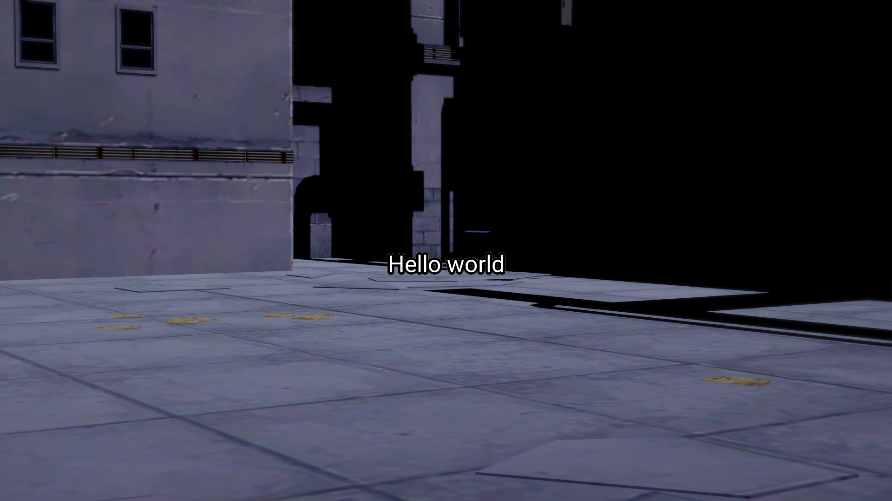

# Koikatsu Automated Subtitles

This small Python program is developed to automate the addition of subtitles to Koikatsu stories.

It is meant to allow the user to experiment with dialogue options quickly, while providing basic subtitling and image processing capabilities.

The user is recommended to apply other creative tools with this as a final pre-processing step for better results. For a demonstration of features, see the `examples` folder (note the scripts are run from the root of the repository).

While I developed this project for personal use, I want to share this in case others find it useful.

## Installation
Recommended Python version is 3.7-3.10.
```
pip install -r requirements.txt
pip install .
```

## Usage
Assume a successful installation and the following folder structure:
```
- input_text_directory
    - example.txt
- input_image_directory
    - example.png
- output_directory
```
The file `example.txt` contains information about the subtitle to add, for example:
```
image_id: example.png
content: Hello world
```
while the file `example.png` is the target image to be subtitled. For example:


Create `script.py` and run:
```
# script.py
from kksubs.kksubs import SubtitleController

controller = SubtitleController()

# set locations for input/output
controller.load_input_image_directory(input_image_directory)
controller.load_input_text_directory(input_text_directory)
controller.load_output_directory(output_directory)

# create subtitled images to output directory
controller.add_subtitles()
```

The result will be saved in `output_directory/example/example.png`:



More examples are demonstrated in the `examples` folder.